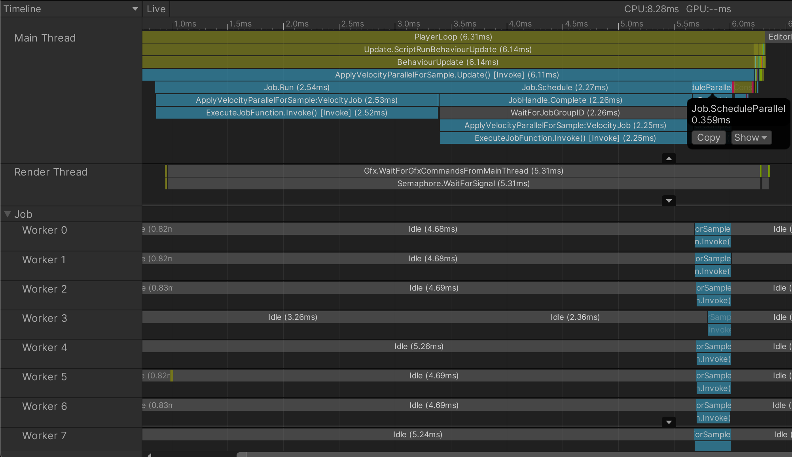

# IJobFor

上一节我们了解了什么是C# Job System，并且使用了**IJob**接口完成了一个简单的AddJob。这一节让我们一起来看一下另外一个有意思的接口**IJobFor**。

**IJobFor**是**IJobParalleFor**的继任者，它包含了后者的所有功能，并且提供了更好的灵活性，因此我们应该尽量使用**IJobFor**而不是**IJobParalleFor**。

让我们先来对比一下**IJob**和**IJobFor**两接口有什么不同：

```C#
public interface IJobFor
{
    void Execute(int index);
}

public interface IJob
{
    void Execute();
}
```

相对于**IJob**，**IJobFor**接口的Execute()方法多了一个index参数，通过这个参数我们可以访问Job中的NativeContainer容器，对容器中的元素进行相对独立的操作。

除此之外，IJobFor还在任务的调度上给我们提供了更大的灵活性。我们可以用下面三种方式来schedule我们的Job：

```C#
public void Update()
{
    ...
    var position = new NativeArray<Vector3>(500, Allocator.Persistent);

    var job = new VelocityJob();
    //run on main thread
    job.Run(position.Length);
    //run on a single worker thread
    job.Schedule(position.Length, dependency);
    //run on parallel worker threads
    job.ScheduleParallel(position.Length, 64, dependency);
    ...
}
```

以上三种方式都需要传入一个arrayLength参数，通过这个参数我们可以控制Execute()方法执行的次数。
实际上我们传入的arrayLength不一定就是数组的长度，它可以是小于数组长度的任意数值，这也给我们Job执行带来了一定的灵活性。

总的来说，通过选择Run, Schedule, ScheduleParallel让我们可以根据任务的特点或使用场景来灵活的进行任务调度。

好，下面让我们进入到Demo环节，这次我们使用的是[Unity官方文档](https://docs.unity3d.com/ScriptReference/Unity.Jobs.IJobFor.html)中的例子，代码如下:

```C#
using UnityEngine;
using Unity.Collections;
using Unity.Jobs;

class ApplyVelocityParallelForSample : MonoBehaviour
{
    struct VelocityJob : IJobFor
    {
        [ReadOnly]
        public NativeArray<Vector3> velocity;
        public NativeArray<Vector3> position;
        public float deltaTime;

        public void Execute(int i)
        {
            position[i] = position[i] + velocity[i] * deltaTime;
        }
    }

    public void Update()
    {
        var position = new NativeArray<Vector3>(500, Allocator.Persistent);

        var velocity = new NativeArray<Vector3>(500, Allocator.Persistent);
        for (var i = 0; i < velocity.Length; i++)
            velocity[i] = new Vector3(0, 10, 0);

        var job = new VelocityJob()
        {
            deltaTime = Time.deltaTime,
            position = position,
            velocity = velocity
        };

        job.Run(position.Length);

        JobHandle sheduleJobDependency = new JobHandle();
        JobHandle sheduleJobHandle = job.Schedule(position.Length, sheduleJobDependency);

        JobHandle sheduleParralelJobHandle = job.ScheduleParallel(position.Length, 64, sheduleJobHandle);

        sheduleParralelJobHandle.Complete();

        Debug.Log(job.position[0]);

        position.Dispose();
        velocity.Dispose();
    }
}
```

让我们先来看一下IJobFor的具体实现：

```C#
struct VelocityJob : IJobFor
{
    [ReadOnly]
    public NativeArray<Vector3> velocity;
    public NativeArray<Vector3> position;
    public float deltaTime;

    public void Execute(int i)
    {
        position[i] = position[i] + velocity[i] * deltaTime;
    }
}
```

首先能注意到的是Execute()方法中，我们通过传入的**i**来访问velocity和position数组，这里就产生了一个问题，如果我们使用**i+1**会发生什么呢？如果你试一下就会得到跟下面类似的一个Exception.

>IndexOutOfRangeException: Index 64 is out of restricted IJobParallelFor range [0...63] in ReadWriteBuffer.

这其实是C# Job System的Safety system在起作用。他会最大限度保证大家在书写多线程代码时的安全性。

另外一个值得注意的地方就是[ReadOnly]属性。当我们把velocity标记为ReadOnly时，我们可以在多个并行的Job中读取velocity数组的内容而不触发safety system。因此我们应该尽量将Job中只读的数据标记成ReadOnly来最大化我们的性能。

最后让我们来看一下IJobFor的三种不同用法在性能上的表现如何，下面是Profiler截图：



在图中我们可以比较明显的观察到Job.Run是运行在主线程的。那Job.Schedule就显得有点奇怪了，他也是运行在主线程上的，这是为什么呢？🤔 其实这是Unity Job System支持的一项特性，叫做任务偷取（Job Steal），当主线程在等待工作（worker）线程执行的过程中也会从任务池中获取任务来执行，很明显，任务偷取在通常情况下会加快所有任务的完成进度。接下来就是Job.ScheduleParallel了，它的执行过程明显要短于前两个，这就要感谢工作（worker）线程了，通过ScheduleParallel我们把任务分发到各个工作线程，让每个线程负责一部分工作，真正做到一方有难，八方支援😁。

稍微总结一下就是，在当前多核心架构当道的大环境下，我们应该尽量使用IJobFor.ScheduleParallel来把任务拆分到多个核心去做并行计算，只有这样我们才能最大化我们程序的执行效率。

好了，以上就是IJobFor的基本用法了，很简单不是么😉，下一节让我们来用IJobFor做一点不一样的东西。
