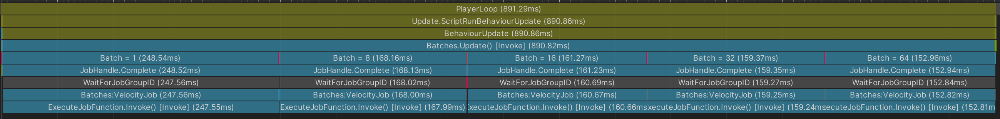
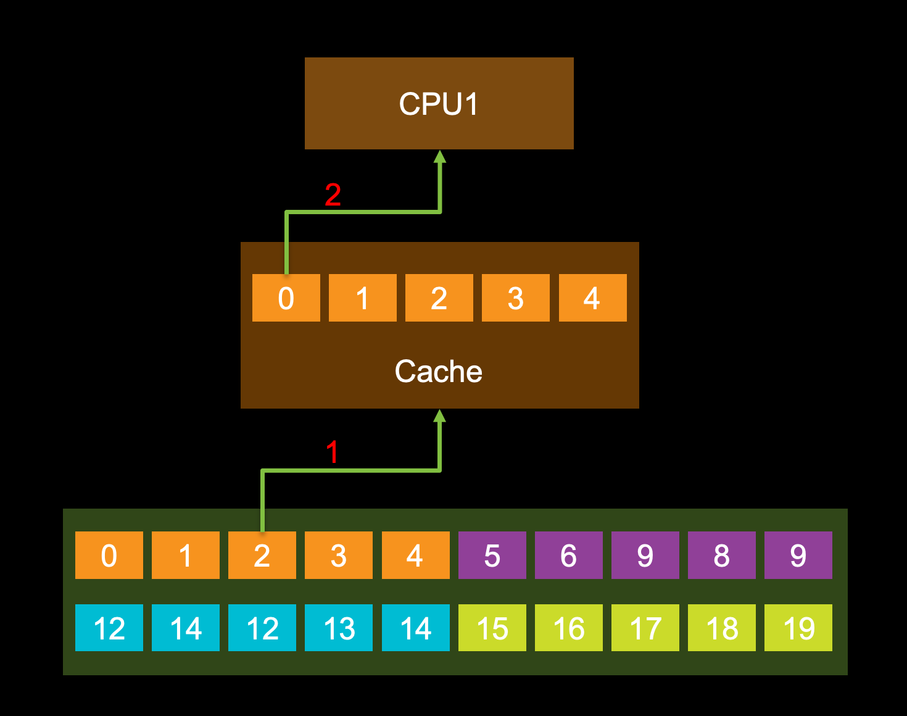
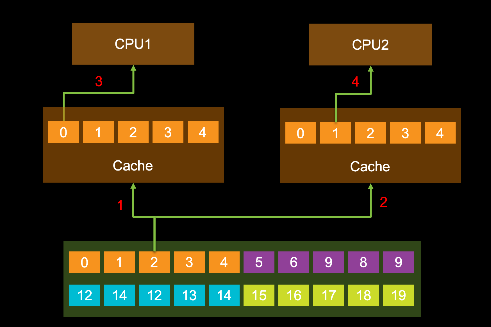
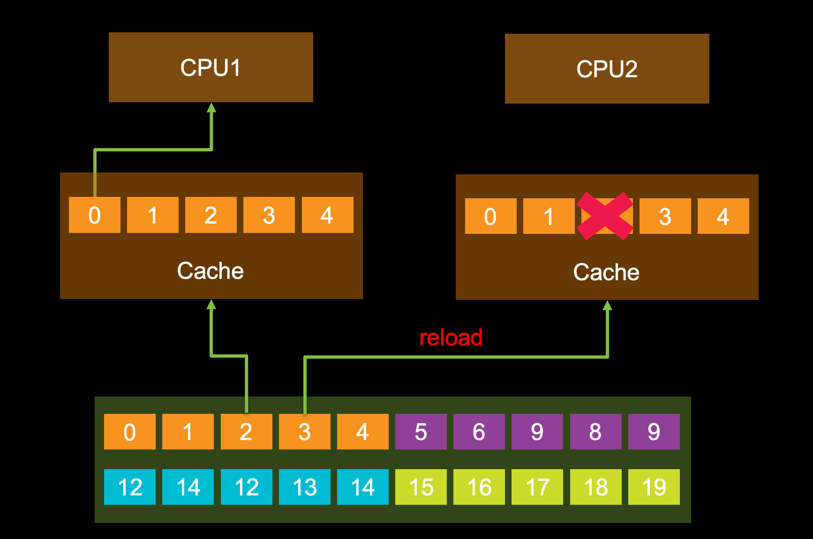

# Batches & False sharing

这一节我们来聊一下``ScheduleParallel()``接口中的``innerloopBatchCount``参数对Job性能的影响。

```C#
public static Unity.Jobs.JobHandle Schedule(T jobData, int arrayLength, int innerloopBatchCount, Unity.Jobs.JobHandle dependsOn);
```

在之前的例子中，当我们调用``ScheduleParallel()``接口的时候，第二个``innerloopBatchCount``参数我们都是给的64，这个值代表什么意思呢？这个大小是否又是合适的呢？让我们一起来探讨一下。

首先按照Unity文档中的说法，这个``innerloopBatchCount``代表的是一个worker在执行任务偷取（workstealing）的时候会按照这个值去拿一定数量的任务，并在这个worker线程中连续调用``innerloopBatchCount``次的``Execute(index)``方法。比如我们的``arrayLength``长度是100，``innerloopBatchCount``是10，这样整个job就会被分成十等份，每个worker拿走其中一份，然后在每个worker中执行10次``Execute(index)``方法。

那64这个值又是否是合适的呢？如果不合适又该如何确定这个值呢？
让我们先来做个测试，测试代码如下：

```C#
var job = new VelocityJob()
{
    deltaTime = Time.deltaTime,
    position = m_Positions,
    velocity = m_Velocity
};

var batchCount = 1;
Profiler.BeginSample($"Batch = {batchCount}");
job.ScheduleParallel(m_Positions.Length, batchCount, new JobHandle()).Complete();
Profiler.EndSample();

batchCount = 8;
Profiler.BeginSample($"Batch = {batchCount}");
job.ScheduleParallel(m_Positions.Length, batchCount, new JobHandle()).Complete();
Profiler.EndSample();

batchCount = 16;
Profiler.BeginSample($"Batch = {batchCount}");
job.ScheduleParallel(m_Positions.Length, batchCount, new JobHandle()).Complete();
Profiler.EndSample();

batchCount = 32;
Profiler.BeginSample($"Batch = {batchCount}");
job.ScheduleParallel(m_Positions.Length, batchCount, new JobHandle()).Complete();
Profiler.EndSample();

batchCount = 64;
Profiler.BeginSample($"Batch = {batchCount}");
job.ScheduleParallel(m_Positions.Length, batchCount, new JobHandle()).Complete();
Profiler.EndSample();
```

我们分别把``innerloopBatchCount``的值设置为1、8、16、32、64来做以下性能对比。

测试结果如下图：
18款 MBP i7


在上图能明显看到当Batch=1时性能最差，Batch=8时性能稍好，当Batch为16的整数倍时，性能是相近的。

我们先来看一下Batch=1时的情况：

当Batch=1时，每个worker去偷取任务的效率最低，此时会增加额外的开销，看上去这个解释已经比较合理了，但是当我们对比Batch为16，32，64时发现性能并没有随着任务偷取的效率提升而提升。说明这里还有其他因素影响了性能。为了说明这个问题让我们先来了解一下CPU是如何从内存中读取数据的：

我们先来看一下一个CPU的情况：


假设这里CPU需要读取数据0。

当CPU需要从内存中读取数据的时候，首先要将数据读取到cache中，但是读取cache是按照cache line为单位来读取的，一般cache line的大小为32或者64字节。于是，CPU1为了读取数据0，同时也把1-4这四个不需要的数据也读取进来了。在单个CPU的场景下这并不会产生任何问题。

我们接着来看一下两个CPU的情况：


这里假设CPU1读取数据0，CPU2读取数据1。

CPU1和CPU2分别处理数据0，和1，他们属于同一cache line，也就意味着两个CPU要把同一个cache line分别加载到各自的缓存中来。如果两个CPU要同时修改同一个cache line这时候就会产生缓存一致性（[Cache coherence](https://en.wikipedia.org/wiki/Cache_coherence#:~:text=In%20computer%20architecture%2C%20cache%20coherence,CPUs%20in%20a%20multiprocessing%20system.)）的问题。为了解决这个问题intel引入了[MESI](https://en.wikipedia.org/wiki/MESI_protocol)协议来解决缓存一致性的问题。对应图中的情况就是：


如果CPU1获得了cache line的所有权，那么就会导致CPU2上已经读取的cache line失效。CPU2就必须要重新从内存中读取这个cache line。这样就导致了CPU2运行效率的降低。这个问题就是伪共享（[false sharing](https://en.wikipedia.org/wiki/False_sharing)）问题。

OK，我们了解了当Batch=1的时候导致运行效率降低的原因，我们再来看一下为什么当Batch数为16的整数倍时运行效率为什么几乎一样。

先来回顾一下``VelocityJob``

```C#
struct VelocityJob : IJobFor
{
    [ReadOnly] public NativeArray<float3> velocity;
    public NativeArray<float3> position;

    public float deltaTime;

    public void Execute(int i)
    {
        position[i] += velocity[i] * deltaTime;
    }
}
```

``velocity``和``position``都是float3类型，他的大小是4 \* 3 = 12字节，我这台电脑的cache line大小是64字节，不难得出 12 \* 16 == 64 \* 3 == 192，因此当batch大小是16的倍数时我们可以完整的利用我们的cache line，可以有效的避免伪共享（false sharing）问题。

[完整代码](https://github.com/vinsli/C-Sharp-Job-System-Essential/blob/main/JobSystemDemos/Assets/JobSystem/IJobForAdvanced-Batches/Batches.cs)