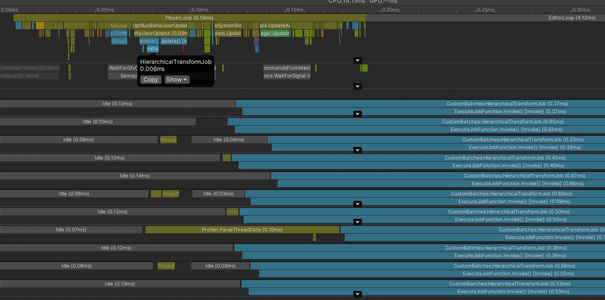
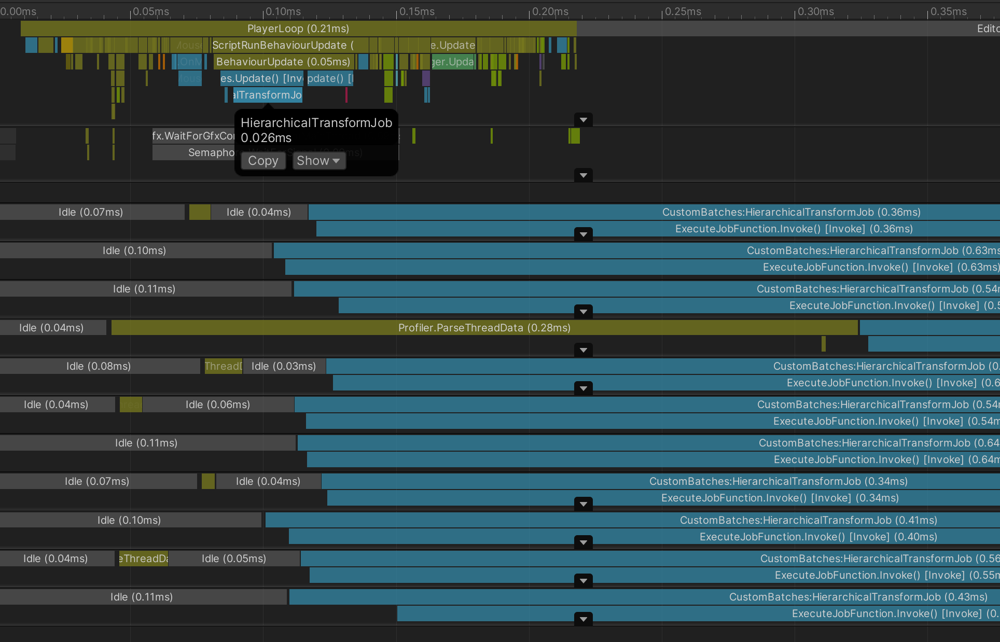

# Custom batch and kick jobs

上一节我们分享了batch大小对性能的影响，Demo可以比较好的说明问题，但是在实际项目中我们常常需要自己控制batch的大小，比如我们希望根据根节点的transform信息更新子节点的位置信息，这时候``IJobFor``接口中index的限制就比较大了，这一节我们就来介绍如何打破``IJobFor``接口的限制，从而允许我们自己来管理batch。

我们先来看一下需求代码：

```C#
struct HierarchicalTransformJob : IJobFor
{
    [ReadOnly] public NativeArray<float3> rootPositions;
    [ReadOnly] public NativeArray<quaternion> rootRotations;
    
    public NativeArray<float3> childLocalPositions;
    public NativeArray<quaternion> childLocalRotations;

    public void Execute(int i)
    {
        var parentPos = rootPositions[i];
        var parentRot = rootRotations[i];

        for (int j = 0; j < 5; j++)
        {
            var index = i * 5 + j;
            
            parentPos += math.mul(parentPos, childLocalPositions[index]);
            parentRot = math.mul(parentRot, childLocalRotations[index]);

            childLocalPositions[index] = parentPos;
            childLocalRotations[index] = parentRot;
        }
    }
}
```

代码中我们希望通过``rootPositions``和``rootRotations``的信息来更新他们下面的各个子节点的位置信息。但是当我们运行这段代码的时候会触发C# Job System的safety system，这时候我们会在检视器（Inspector）中发现如下报错：

```Log
IndexOutOfRangeException: Index 64 is out of restricted IJobParallelFor range [0...63] in ReadWriteBuffer.
ReadWriteBuffers are restricted to only read & write the element at the job index. You can use double buffering strategies to avoid race conditions due to reading & writing in parallel to the same elements from a job.
```

报错的原因是因为我们在``Execute(index)``方法中访问了下标为非``index``的数据。如果我们想打破``IJobFor``的这种限制，需要为不遵循``index``访问规则限制的数据添加``[NativeDisableContainerSafetyRestriction]``属性，这样就可以绕开safety system，但是这种情况下，需要**我们自己来保证数据的线程安全**，Unity不会为我们的数据安全负责。幸运的是上面的代码可以保证线程安全。我们只需要给``childLocalPositions``和``childLocalRotations``添加``[NativeDisableContainerSafetyRestriction]``就可以了，修改后的代码如下：

```C#
struct HierarchicalTransformJob : IJobFor
{
    [ReadOnly] public NativeArray<float3> rootPositions;
    [ReadOnly] public NativeArray<quaternion> rootRotations;
    
    [NativeDisableContainerSafetyRestriction]
    public NativeArray<float3> childLocalPositions;
    [NativeDisableContainerSafetyRestriction]
    public NativeArray<quaternion> childLocalRotations;

    public void Execute(int i)
    {
        var parentPos = rootPositions[i];
        var parentRot = rootRotations[i];

        for (int j = 0; j < 5; j++)
        {
            var index = i * 5 + j;
            
            parentPos += math.mul(parentPos, childLocalPositions[index]);
            parentRot = math.mul(parentRot, childLocalRotations[index]);

            childLocalPositions[index] = parentPos;
            childLocalRotations[index] = parentRot;
        }
    }
}
```

好了，我们顺利解决了safety system报错的问题。下面我们来看一下调度（schedule）代码。

```C#
private void Update()
{
    var job = new HierarchicalTransformJob()
    {
        rootPositions = m_RootPositions,
        rootRotations = m_RootRotations,

        childLocalPositions = m_LocalPositions,
        childLocalRotations = m_LocalRotations
    };
    
    Profiler.BeginSample("HierarchicalTransformJob");
    m_JobHandle = job.ScheduleParallel(m_RootPositions.Length, 64, new JobHandle());
    m_JobHandle.Complete();
    Profiler.EndSample();
}
```

这段代码其实并不符合实际项目中的情况。问题出在哪？我们使用worker线程一般情况下有两种诉求，一种是利用多线程加速我们的计算，另一种是希望把工作转移到work线程，从而不会卡住我们的主线程。

但是上面的代码中，我们在调度（schedule）了任务之后，选择了直接调用``Complete()``方法来完成任务。这样我们就无法达成第二种诉求。为了不让Job阻塞主线程，我们把代码改成如下形式：

```C#
private void Update()
{
    m_JobHandle.Complete();
    var job = new HierarchicalTransformJob()
    {
        rootPositions = m_RootPositions,
        rootRotations = m_RootRotations,

        childLocalPositions = m_LocalPositions,
        childLocalRotations = m_LocalRotations
    };
    
    Profiler.BeginSample("HierarchicalTransformJob");
    m_JobHandle = job.ScheduleParallel(m_RootPositions.Length, 64, new JobHandle());
    // m_JobHandle.Complete();
    Profiler.EndSample();
}
```

我们选择在下一帧调用``Complete()``方法。这样就不会卡住主线程了。OK，我们来看一下Profiler确认一下是否如我们想的一样。



看上去没有任何问题，但是，等一下，为什么任务没有立即执行？我们的任务并没有立刻进入运行状态而是等了一段时间才开始执行。这是怎么回事🤔？

这是因为在某些平台上（尤其是移动平台）唤醒worker线程的开销是比较高的，因此Unity在我们调用调度（Schedule()）方法的时候只会把Job存在本地，直到我们调用``JobHandle.ScheduleBatchedJobs()``的时候才会去唤醒worker线程执行Job。
于是，我们的代码可以改成如下形式：

```C#
private void Update()
{
    m_JobHandle.Complete();
    var job = new HierarchicalTransformJob()
    {
        rootPositions = m_RootPositions,
        rootRotations = m_RootRotations,

        childLocalPositions = m_LocalPositions,
        childLocalRotations = m_LocalRotations
    };
    
    Profiler.BeginSample("HierarchicalTransformJob");
    m_JobHandle = job.ScheduleParallel(m_RootPositions.Length, 64, new JobHandle());
    // m_JobHandle.Complete();
    JobHandle.ScheduleBatchedJobs();
    Profiler.EndSample();
}
```

好了，我们再来看一下Profiler：



OK，现在一切都符合我们的预期了😁。

One more thing，在2019.3中增加了[JobsUtility.JobWorkerCount](https://docs.unity3d.com/ScriptReference/Unity.Jobs.LowLevel.Unsafe.JobsUtility.JobWorkerCount.html)接口，来调节当前可以执行Job的worker数量。这在移动平台（尤其是安卓）也非常有用，大家可以自行查看。

[完整代码](https://github.com/vinsli/C-Sharp-Job-System-Essential/blob/main/JobSystemDemos/Assets/JobSystem/IJobForAdvanced-CustomBatches/CustomBatches.cs)