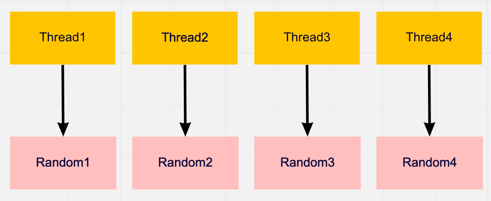

# Thread Local

这节让我们一起来思考一个游戏中比较常见的例子——随机数的使用。

这在以前是一个很简单的问题，因为Unity其实已经为我们准备好了响应的函数封装——[**UnityEngine.Random**](https://docs.unity3d.com/ScriptReference/Random.html)，我们只需要调用相应的API就可以了。

但是在多线程环境下这种情况发生了一些变化。其实从Unity文档中我们就可以总结出**UnityEngine.Random**有以下特点：

1. 是一个class
2. Static的单例
3. 内部状态全局共享

根据以上特点我们不难总结出**UnityEngine.Random**并不适合在C# Job System中使用。

针对第一点Unity已经给出了相应的替代实现，那就是在[**mathmatics**](https://docs.unity3d.com/Packages/com.unity.mathematics@1.2/manual/index.html)包中的[**Random**](https://docs.unity3d.com/Packages/com.unity.mathematics@1.2/api/Unity.Mathematics.Random.html)。

但是第2、3点还需要我们自己编码来解决，这就引出了我们今天的主题——基于线程本地存储（Thread Local Storage，下称TLS）的随机数使用。

废话不多说，我们上代码：

```C#
struct RandomVelocityJob : IJobFor
{
    [ReadOnly]
    public NativeArray<float> speeds;
    [ReadOnly] 
    public Random random;
    public float deltaTime;

    //output
    public NativeArray<float3> positions;

    public void Execute(int i)
    {
        positions[i] += random.NextFloat3Direction() * speeds[i] * deltaTime;
    }
}

var random = new Random(1234);
var randomVelocityJob = new RandomVelocityJob
{
    speeds = m_Speeds,
    random = random,
    positions = m_Positions,
    deltaTime = Time.deltaTime,
};
```

在上一节Demo的基础上，我们希望每次position移动的方向是随机的，于是我们加入了一个新的Random变量在每次执行`Execute()`方法的时候去随机一个新的方向去做位置计算。代码非常简单明了，但是却隐藏着问题。

问题来自于`random`变量，虽然`NextFloat3Direction()`看上去人畜无害，但是他会改变`random`的内部状态，这就导致了所有的worker线程会共享并改变`random`的状态，使`random`处在竞争条件（race condition）的状态。

我们需要找到一种线程安全的方式来使用`random`变量。

首先想到的就是加锁，显然这是效率比较低的做法。还有另外一种比较经典的做法就是使用线程本地存储（TLS），让每个线程拥有一份自己独有的资源，这样就自然避免了竞争条件（race condition）的问题。



为了实现TLS，我们首先需要为每一个worker线程初始化一个random变量。这里我们使用`JobsUtility.MaxJobThreadCount`来获取worker的最大数量。代码如下：

```C#
m_Randoms = new NativeArray<Random>(JobsUtility.MaxJobThreadCount, Allocator.Persistent);
for (int i = 0; i < m_Randoms.Length; i++)
{
    m_Randoms[i] = Random.CreateFromIndex((uint)i);
}
```

在Job中我们需要知道当前执行的线程ID，我们可以在Job中声明一个int类型的变量并添加`[NativeSetThreadIndex]`属性，在job执行的过程中Unity会帮我们自动注入这个ID。
这样我们就可以在`Execute()`方法中利用线程ID获取线程独有的资源了。

```C#
struct RandomVelocityJob : IJobFor
{
    //input
    [ReadOnly]
    public NativeArray<float> speeds;
    [ReadOnly] 
    public NativeArray<Random> randoms;
    public float deltaTime;
    
    [NativeSetThreadIndex]
    private int m_ThreadIdx;

    //output
    public NativeArray<float3> positions;

    public void Execute(int i)
    {
        positions[i] += randoms[m_ThreadIdx].NextFloat3Direction() * speeds[i] * deltaTime;
    }
}
```

[完整代码](https://github.com/vinsli/C-Sharp-Job-System-Essential/blob/main/JobSystemDemos/Assets/JobSystem/IJobForAdvanced-ThreadLocal/ThreadLocalVelocity.cs)

经过简单的几步我们就实现了一个TLS。希望可以给大家带来一些启发。
