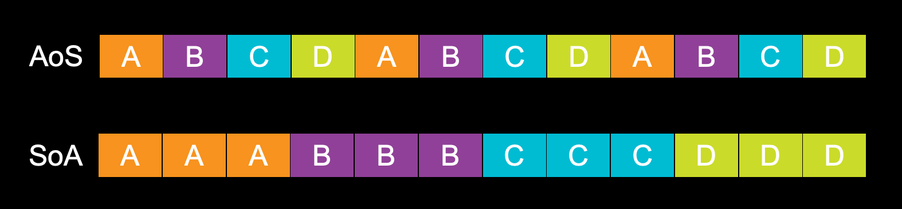
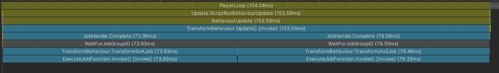
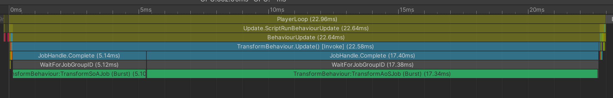

# SoA vs AoS

今天我们聊一点内存中数据组织的话题，题目中提到了两个名词array of structures (AoS)和structure of arrays (SoA)，这分别代表着两种不同的数组组织形式。比如下面一段代码：

```C#
struct AoSData
{
    public int a;
    public int b;
    public int c;
    public int d;
}

struct SoAData
{
    public NativeArray<int> aArray;
    public NativeArray<int> bArray;
    public NativeArray<int> cArray;
    public NativeArray<int> dArray;
}
```

他们的数据在内存中的布局就如下图：



从图中不难看出``AoSData``的数据`a`，`b`，`c`，`d`在内存中是交错存在的。而``SoAData``中相同的数据在内存中是连续存在的。

可能大家从刚接触编程开始，一直会使用``AoSData``这种形式，这确实是普遍使用的一种数组组织形式，因为这符合大家的思维习惯而且天然的被大多数编程语言所支持。不知道大家在学习编程的过程中是否思考过这种数据组织形式的优劣，不妨让我们一起结合前几篇文章的内容来一起思考一下：

这里假设`a`，`b`，`c`，`d`四个数据的大小是一样的并且当前CPU的cache line一次可以加载4个数据即一个cache line可以加载`a`，`b`，`c`，`d`或者`a`，`a`，`a`，`b`四个数据。

让我们一起来看一下在使用``AoSData``的情况下我们要访问所有的`a`数据（使用上图的内存数据）CPU需要访问几次内存：

>第一次：加载abcd，找到第一个a
>  
>第二次：加载abcd，找到第二个a
>  
>第三次：加载abcd，找到第三个a

使用``AoSData``的情况下，我们一共访问了3次内存。

再来看一下使用``SoAData``的情况：

>第一次：加载aaab，找到三个a

很明显``SoAData``对数据的访问效率更高，CPU的执行效率自然也更高。还有另外一点，就是SoA对SIMD指令更加友好，Burst对SoA形式的数据也有特别的支持，这一点我们下一章会聊到，这里暂时就不展开了。

OK，Demo时间到了，这次我们来模拟Unity中的Transform，通过AoS和SoA两种数据定义来对比一下他们对性能的不同影响，先给出两种数据定义：

```C#
public struct TransformAoS
{
    public float3 position;
    public quaternion rotation;
    public float3 scale;
}

public class TransformSoA
{
    public NativeArray<float3> positions;
    public NativeArray<quaternion> rotations;
    public NativeArray<float3> scales;
}
```

以上就是Unity中典型的AoS和SoA数据的组织形式了，接下来我们来看一下AoS的Job实现：

```C#
public struct TransformAoSJob : IJobFor
{
    public NativeArray<TransformAoS> transformAoSes;
    [ReadOnly] public float3 velocity;
    [ReadOnly] public float deltaTime;
    
    public void Execute(int index)
    {
        var transAoS = transformAoSes[index];
        transAoS.position += velocity * deltaTime;
        transformAoSes[index] = transAoS;
    }
}
```

这里有一个比较值得注意的点，``var transAoS = transformAoSes[index];``这一句中，因为``TransformAoS``是struct类型，当赋值时，会产生一次结构体拷贝（struct blit），在结构体比较小的时候性能开销并不高，但是当结构体中数据量比较大的时候，值拷贝产生的性能开销就不能忽略不计了。另外一个问题是，``transAoS``既然已经是一个拷贝了，我们对他的修改就不会反映在数据本体上，所以在Job的最后我们把拷贝出来的值又赋值回了transformAoSes数组，这样就又产生了一次数据拷贝。有没有更好的办法么？答案当然是肯定的。

Unity在[NativeArrayUnsafeUtility](https://docs.unity3d.com/ScriptReference/Unity.Collections.LowLevel.Unsafe.NativeArrayUnsafeUtility.html)中为我们提供了``GetUnsafePtr()``方法，我们可以利用指针来获取原始数据的引用，代码可以改成如下形式：

```C#
public struct TransformAoSJob : IJobFor
{
    public NativeArray<TransformAoS> transformAoSes;
    [ReadOnly] public float3 velocity;
    [ReadOnly] public float deltaTime;

    public void Execute(int index)
    {
        // var transAoS = transformAoSes[index];
        // transAoS.position += velocity * deltaTime;
        // transformAoSes[index] = transAoS;

        var transformPtr = (TransformAoS*)transformAoSes.GetUnsafePtr();
        ref var transform = ref transformPtr[index];
        transform.position += velocity * deltaTime;
    }
}
```

OK，我们再来看一下SoA的Job实现：

```C#
public struct TransformSoAJob : IJobFor
{
    [NoAlias] public NativeArray<float3> positions;
    [ReadOnly] public float3 velocity;
    [ReadOnly] public float deltaTime;

    public void Execute(int index)
    {
        positions[index] += velocity * deltaTime;
    }
}
```

SoA形式的Job代码就简洁多了，因为我们可以直接以最高效率访问需要的数据，代码也更加纯粹。（同样也需要注意struct blit的问题）

代码有了，让我们对比一下两者的性能表现吧。



哈？拉了拉了。。扯了半天就这？这俩简直就是一模一样好吧。。

我只能说这口锅只能mono背了，为了证明我没有错，是时候请出老大哥[Burst](https://docs.unity3d.com/Packages/com.unity.burst@1.6/manual/index.html)了。我们给这两个Job加上``[BurstCompile]``属性再来测试一下：



请忽略Burst给我们带来的**15倍**性能提升（手动狗头）。经过Burst编译之后的代码可以充分看出SoA相较于AoS的性能优势。

简单总结一下，相较于AoS，SoA更能发挥Burst的性能优势。

从Profiler数据中我们可以看到SoA相较于AoS有着300%的性能提升，300%似乎也不是很值得我们改变已经很熟悉的AoS书写习惯嘛，如果你也是这么想的，下一章我们一起来把这个数字提升到700%，是不是很有吸引力了呢？😁
